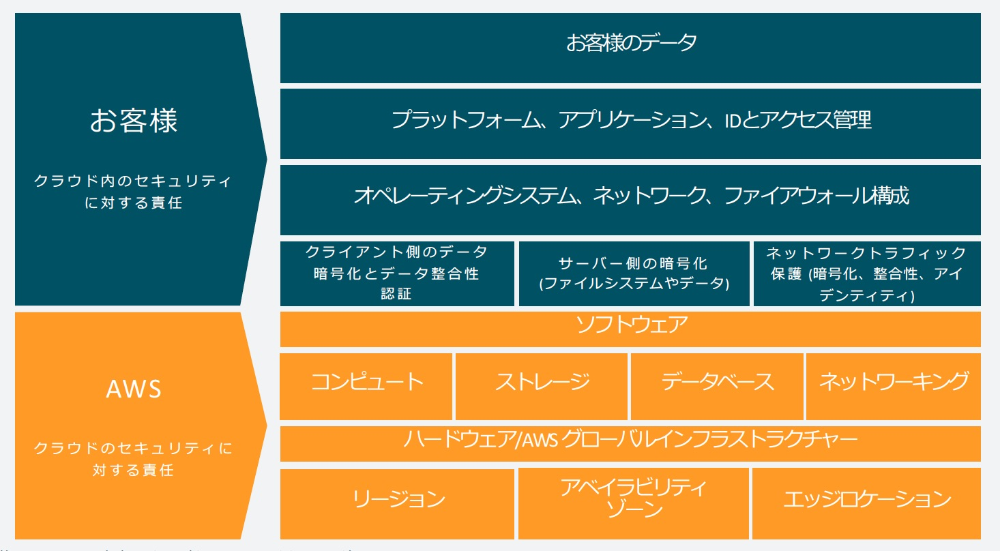

###### 目次

```toc
exclude: 目次
tight: false,
from-heading: 2
to-heading: 6
```

## AWSリソースへのセキュアなアクセスの設計

### Amazon VPC（Amazon Virtual Private Cloud）
セキュアな外からはアクセスできなよ。といった空間を作ることができるサービスとなっている。

完全にアクセスできないのは利便性が低いので、 **色々なコンポーネント** を追加することにより **きめ細やかなネットワーク** を構築することができる。

`EC2やRDSとはすべてこの中で動くようになっている。`

#### サブネット
- **パブリックサブネット**
    - **Elastic Network Interfaceに関連付け**
    - **ルール許可のみをサポート**
    - **ステートフル**

**`NICなので当たっているEC2インスタンスサーバ単位でパケットの制御をすることができる。`**

> パブリックインターネットへの直接アクセスをサポートし、インターネットゲートウェイへのルーティングテーブルエントリで指定する。

- **プライベートサブネット**
    - **サブネットに関連付け**
    - **ルールの許可と拒否をサポート**
    - **ステートレス**

**`サブネット単位なので、サブネットに入っているインスタンス等はすべて影響を受ける。`**  
**`サブネット単位で一括にどこどこのポートを落としてしまうなんていう制御をおこなうことができる。`**

> インターネットゲートウェイへのルーティングテーブルエントリがなく、NAT経由でパブリックインターネットに間接的にアクセスする。

**用語のようなものだと思って押さえておくとよい、試験でもこのような感じで出てくる。**

パブリックサブネットやプライベートサブネットで当たっている対象に違いがあることを認識しておく。

#### セキュリティグループ
アプリケーション層のセキュリティグループ、データ層のセキュリティグループといった具合で層によって、アクセスの振る舞いを変更したいときなどに用いるものである。  
**トラフィックの制御をおこなうことができる。**

#### Amazon VPC接続
Amazon VPCでトラフィックをやり取りするサービスとして、 **AWS Direct Connect** や **VPCピアリング接続** といった方法なども存在するので試験の前に一度確認する必要がある。

## セキュアなアプリケーション階層の設計

### 責任共有モデル
AWSは **クラウドの** セキュリティに責任を持ち、お客様は **クラウド内の** セキュリティに責任をもつ。

AWSの基盤サービスやAWSグローバルインフラストラクチャといったお客様側で触れない部分は **AWS側** が責任を持つ形となっている。

基盤側より上のレイヤー、EC2インスタンスの中には、AWS側はアクセスできなので **お客様側** で責任をもって管理する必要がある。

**マネージドサービス** になってくればくるほど、 **AWS側で** 責任を持つ範囲が広くなる。

  
> AWS責任共有モデル図：https://aws.amazon.com/jp/compliance/shared-responsibility-model/

### IAM（AWS Identity and Access Management）
誰がEC2インスタンスを **消してもいい** 、誰が **S3にバケットへオブジェクトを投入してもいい** といったアクセス管理を細かく設定することができるサービスとなっている。

`誰彼構わず管理者権限を付与するのではなく必要最小権限を付与するという原則がある。`

**IAMは凄く複雑になっているので試験を受ける前に一度、確認しておく必要がある。**

## 適切なデータセキュリティオプションの選択

### 転送中のデータ
AWSに対して、データの転送が発生する場合で、S3とDynamoDB間の通信等は **SSL/TLS** 接続で暗号化されているので途中の経路で盗聴されることはない。

VPC上への資産に対して安全にアクセスをしたいという場合には、 **VPNやAmazon DirectConnect** 等のサービスを使用して接続することもできるので覚えておく必要がある。

**AWS APIへのデータ送信** は、 AWS APIコールでHTTPSを使用し、すべてのAPIコールでSigv4の署名がなされる。

### 保管中のデータ
Amazon S3を例に、保存されたデータはデフォルトでプライベートなので、公開はされていないものとなるがユーザ側で細かい設定をして外部に公開することも可能である。  
`この場合、アクセス管理等についてユーザ側で責任をもって管理をしていく必要がある。`

#### データの暗号化  
S3に保管されているデータ自体の暗号化について、 **サーバサイド暗号化** および **クライアントサイド暗号化** というものが存在する。

- **クライアントサイド暗号化**
    - **AWS KMSで管理するカスタマーマスターキー（CSE-KMS）**
    - **クライアント側のマスターキー（CSE-C）**

> 等が存在する。

自分のPCなどでOpenSSL等のコマンドを用いデータを暗号化しその **暗号化した文字列等** をS3へ保管するというもので **作成したキー** 等についてはユーザ側で責任を持って管理をする必要がある。

- **サーバサイド暗号化**
    - **Amazon S3で管理するキー（SSE-S3）**
    - **AWS KMSで管理するキー（SSE-KMS）**
    - **顧客が提供するキー（SSE-C）**

> 等が存在する。

## 参考文献
[TAC-3：AWS 認定 - 試験準備ワークショップ 「ソリューションアーキテクト ? アソシエイト」セッション 2](https://resources.awscloud.com/aws-summit-online-japan-2020-on-demand-tc-24866/tac-04-aws-summit-online-2020-tcsaa)
