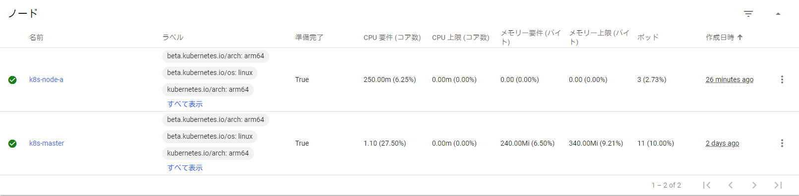
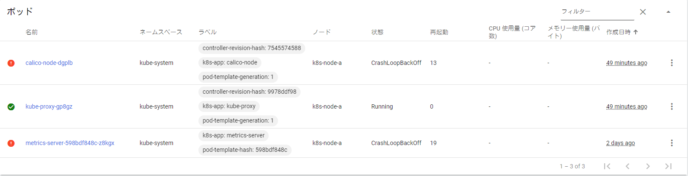

###### 目次

```toc
exclude: 目次
tight: false,
from-heading: 2
to-heading: 6
```

## 概要

今回は、「Raspberry Pi 4 Model B/4GB」にインストールしたKubernetes  
シングルマスターへワーカーノードを1台追加してみたいと思います。

使用する環境は、「Ubuntu 20.10 aarch64」となります。  
すべて管理者権限で操作をします。

**この記事ではシングルマスター構築は触れませんので注意してください。**

## 手順

## Dockerのインストール

### ファイアウォールの無効化

Kubernetesが動作する上でFWが原因で動作に問題が生じないように無効化します。

`systemctl disable ufw.service`

`systemctl stop ufw.service`

`root@k8s-node-a:~# systemctl is-enabled ufw.service`

```bash
disabled
```

`root@k8s-node-a:~# systemctl is-active ufw.service`

```bash
inactive
```

### パッケージインデックスを最新に更新

`root@k8s-node-a:~# apt-get update`

```bash
864 kB を 5秒 で取得しました (171 kB/s)
パッケージリストを読み込んでいます... 完了
```

### HTTPS経由でインストールできるようにするための準備

```bash
apt-get install \
    apt-transport-https \
    ca-certificates \
    curl \
    gnupg-agent \
    software-properties-common
```

上記コマンドを実行、実行すると下記のように続行するか聞かれるので「y」と押しEnterします。

```bash
・
・[中略]
・
この操作後に追加で 209 kB のディスク容量が消費されます。
続行しますか? [Y/n] y
・
・[中略]
・
```

### DockerオフィシャルGPGキー追加

`root@k8s-node-a:~# curl -fsSL https://download.docker.com/linux/ubuntu/gpg | sudo apt-key add -`

```bash
Warning: apt-key is deprecated. Manage keyring files in trusted.gpg.d instead (see apt-key(8)).
OK
```

下記コマンドでインストールされたことを確認できます。

`root@k8s-node-a:~# apt-key list`

```bash
Warning: apt-key is deprecated. Manage keyring files in trusted.gpg.d instead (see apt-key(8)).
/etc/apt/trusted.gpg
--------------------
・
・[中略]
・
pub   rsa4096 2017-02-22 [SCEA]
      9DC8 5822 9FC7 DD38 854A  E2D8 8D81 803C 0EBF CD88
uid           [  不明  ] Docker Release (CE deb) <docker@docker.com>
sub   rsa4096 2017-02-22 [S]
・
・[中略]
・
------------------------------------------------------
・
・[中略]
・
```

### Docker Arm64版リポジトリ追加

```bash
add-apt-repository \
   "deb [arch=arm64] https://download.docker.com/linux/ubuntu \
   $(lsb_release -cs) \
   stable"
```

コマンドを実行すると以下のようにDocker arm64レポジトリが取得されていることが分かりますね。

また、httpsを経由していることも同時に分かりますね。

```bash
Repository: 'deb [arch=arm64] https://download.docker.com/linux/ubuntu groovy stable'
Description:
Archive for codename: groovy components: stable
More info: https://download.docker.com/linux/ubuntu
Adding repository.
Press [ENTER] to continue or Ctrl-c to cancel.
Adding deb entry to /etc/apt/sources.list.d/archive_uri-https_download_docker_com_linux_ubuntu-groovy.list
Adding disabled deb-src entry to /etc/apt/sources.list.d/archive_uri-https_download_docker_com_linux_ubuntu-groovy.list
取得:1 https://download.docker.com/linux/ubuntu groovy InRelease [27.4 kB]
取得:2 https://download.docker.com/linux/ubuntu groovy/stable arm64 Packages [4,983 B]
・
・[中略]
・
32.3 kB を 3秒 で取得しました (12.7 kB/s)
パッケージリストを読み込んでいます... 完了
```

後から追加したレポジトリのリストは、`/etc/apt/sources.list.d/`に記録されます。

`cat /etc/apt/sources.list.d/archive_uri-https_download_docker_com_linux_ubuntu-groovy.list`

```bash
deb [arch=arm64] https://download.docker.com/linux/ubuntu groovy stable
# deb-src [arch=arm64] https://download.docker.com/linux/ubuntu groovy stable
```

### Dockerエンジン（コミュニティ）版のインストール

パッケージインデックスを最新に更新します。

`root@k8s-node-a:~# apt-get update`

containerdはDocker社が開発している、コンテナーランタイムになりDockerのコンポーネントの一部として動作します。

途中で続行するか聞かれるので「y」を入力後、Enterを押します、その後、シムリンクが張られ自動起動ONになることが確認できます。

`root@k8s-node-a:~# apt-get install docker-ce docker-ce-cli containerd.io`

```bash
パッケージリストを読み込んでいます... 完了
依存関係ツリーを作成しています
状態情報を読み取っています... 完了
以下の追加パッケージがインストールされます:
  docker-ce-rootless-extras libslirp0 pigz slirp4netns
提案パッケージ:
  cgroupfs-mount | cgroup-lite
以下のパッケージが新たにインストールされます:
  containerd.io docker-ce docker-ce-cli docker-ce-rootless-extras libslirp0 pigz slirp4netns
アップグレード: 0 個、新規インストール: 7 個、削除: 0 個、保留: 0 個。
83.9 MB のアーカイブを取得する必要があります。
この操作後に追加で 397 MB のディスク容量が消費されます。
続行しますか? [Y/n] y
・
・
・
containerd.io (1.4.3-1) を設定しています ...
Created symlink /etc/systemd/system/multi-user.target.wants/containerd.service → /lib/systemd/system/containerd.service.
docker-ce-cli (5:20.10.4~3-0~ubuntu-groovy) を設定しています ...
libslirp0:arm64 (4.3.1-1) を設定しています ...
pigz (2.4-1) を設定しています ...
slirp4netns (1.0.1-1) を設定しています ...
docker-ce (5:20.10.4~3-0~ubuntu-groovy) を設定しています ...
Created symlink /etc/systemd/system/multi-user.target.wants/docker.service → /lib/systemd/system/docker.service.
Created symlink /etc/systemd/system/sockets.target.wants/docker.socket → /lib/systemd/system/docker.socket.
docker-ce-rootless-extras (5:20.10.4~3-0~ubuntu-groovy) を設定しています ...
systemd (246.6-1ubuntu1.1) のトリガを処理しています ...
man-db (2.9.3-2) のトリガを処理しています ...
libc-bin (2.32-0ubuntu3) のトリガを処理しています ...
```

### 一般ユーザでもdockerを使えるようにする

`root@k8s-node-a:~# gpasswd -a ubuntu docker`

```bash
ユーザ ubuntu をグループ docker に追加
```

追加されたことは分かりますね。

`root@k8s-node-a:~# grep docker /etc/group`

```bash
docker:x:998:ubuntu
```

## Kubernetesワーカーノード構築

### 事前準備

memoryが「0」無効化状態だとマスターを構築する際にERRORがでたので念の為、ワーカーノード側でも有効化状態に変更します。

現在は、下記の通り無効化状態であることが確認できます。

`root@k8s-node-a:~# cat /proc/cgroups`

```bash
#subsys_name    hierarchy       num_cgroups     enabled
・
・[中略]
・
memory  0       109     0
・
・[中略]
・
```

書き込み前の内容となります。

`root@k8s-node-a:~# cat /boot/firmware/cmdline.txt`

```bash
dwc_otg.lpm_enable=0 console=serial0,115200 console=tty1 root=LABEL=writable rootfstype=ext4 elevator=deadline rootwait fixrtc quiet splash
```

以下内容をboot時に読み込むファイルへ書き込みます。

末尾につづけて書くようにします。

`vi /boot/firmware/cmdline.txt`

```bash
cgroup_enable=cpuset cgroup_enable=memory cgroup_memory=1
```

筆者、環境では書き込み後以下のようになりました。

`root@k8s-node-a:~# cat /boot/firmware/cmdline.txt`

```bash
dwc_otg.lpm_enable=0 console=serial0,115200 console=tty1 root=LABEL=writable rootfstype=ext4 elevator=deadline rootwait fixrtc quiet splash cgroup_enable=cpuset cgroup_enable=memory cgroup_memory=1
```

このままでは設定が適用されないのでOS再起動をおこないます。

`root@k8s-node-a:~# reboot`

無効状態「0」だったのが有効状態「1」になっていることが確認できますね。

`root@k8s-master:~# cat /proc/cgroups`

```bash
#subsys_name    hierarchy       num_cgroups     enabled
・
・[中略]
・
memory  11      486     1
・
・[中略]
・
```

KubernetesではSWAP領域を無効化することが条件になっていますので確認します。

以下コマンドでSWAPが有効になっているか確認できます、筆者環境では元々、SWAP領域がなかったようです。

この場合、なんの問題もないのでスルーしましょう。

`root@k8s-master:~# /sbin/swapon -s`

`root@k8s-master:~# cat /proc/swaps`

```bash
Filename                                Type            Size            Used            Priority
```

### iptablesがnftablesバックエンドを使用しないようにする

Kubernetesはnftablesと互換性がないので以下コマンドをしようしてiptablesを使用するよう設定します。

`root@k8s-node-a:~# apt-get install -y iptables arptables ebtables`

`root@k8s-node-a:~# update-alternatives --set iptables /usr/sbin/iptables-legacy`

`root@k8s-node-a:~# update-alternatives --set ip6tables /usr/sbin/ip6tables-legacy`

`root@k8s-node-a:~# update-alternatives --set arptables /usr/sbin/arptables-legacy`

`root@k8s-node-a:~# update-alternatives --set ebtables /usr/sbin/ebtables-legacy`

### KubernetesオフィシャルGPGキー追加

`root@k8s-node-a:~# curl -s https://packages.cloud.google.com/apt/doc/apt-key.gpg | sudo apt-key add -`

```bash
Warning: apt-key is deprecated. Manage keyring files in trusted.gpg.d instead (see apt-key(8)).
OK
```

下記コマンドでインストールされたことを確認できます。

`root@k8s-node-a:~# apt-key list`

```bash
Warning: apt-key is deprecated. Manage keyring files in trusted.gpg.d instead (see apt-key(8)).
/etc/apt/trusted.gpg
--------------------
・
・[中略]
・
pub   rsa2048 2018-04-01 [SCE] [有効期限: 2021-03-31]
      54A6 47F9 048D 5688 D7DA  2ABE 6A03 0B21 BA07 F4FB
uid           [  不明  ] Google Cloud Packages Automatic Signing Key <gc-team@google.com>
・
・[中略]
・
------------------------------------------------------
・
・[中略]
・
```

### Kubernetessリポジトリ追加

```bash
cat <<EOF | sudo tee /etc/apt/sources.list.d/kubernetes.list
deb https://apt.kubernetes.io/ kubernetes-xenial main
EOF
```

レポジトリの設定ができたことを確認できますね。

`root@k8s-node-a:~# cat /etc/apt/sources.list.d/kubernetes.list`

```bash
deb https://apt.kubernetes.io/ kubernetes-xenial main
```

### Kubernetessインストール

パッケージインデックスを最新に更新します。

`root@k8s-node-a:~# apt-get update`

以下、ツールのインストールをおこないます。

- kubeadm：クラスターを起動するコマンドです。
- kubelet　：クラスターの各ノードでPodを管理するコンポーネントです。
- kubectl　：クラスターにアクセスするためのコマンドラインツールです。

`apt-get install -y kubelet kubeadm kubectl`

```bash
パッケージリストを読み込んでいます... 完了
依存関係ツリーを作成しています
状態情報を読み取っています... 完了
以下の追加パッケージがインストールされます:
  conntrack cri-tools kubernetes-cni socat
提案パッケージ:
  nftables
以下のパッケージが新たにインストールされます:
  conntrack cri-tools kubeadm kubectl kubelet kubernetes-cni socat
アップグレード: 0 個、新規インストール: 7 個、削除: 0 個、保留: 0 個。
61.2 MB のアーカイブを取得する必要があります。
この操作後に追加で 277 MB のディスク容量が消費されます。
・
・[中略]
・
kubeadm (1.20.4-00) を展開しています...
conntrack (1:1.4.6-1) を設定しています ...
kubectl (1.20.4-00) を設定しています ...
socat (1.7.3.4-1) を設定しています ...
cri-tools (1.13.0-01) を設定しています ...
kubernetes-cni (0.8.7-00) を設定しています ...
kubelet (1.20.4-00) を設定しています ...
Created symlink /etc/systemd/system/multi-user.target.wants/kubelet.service → /lib/systemd/system/kubelet.service.
kubeadm (1.20.4-00) を設定しています ...
man-db (2.9.3-2) のトリガを処理しています ...
```

先ほどインストールツールのバージョンを固定にします。

`apt-mark hold kubelet kubeadm kubectl`

```bash
kubelet は保留に設定されました。
kubeadm は保留に設定されました。
kubectl は保留に設定されました。
```

固定化されたことが確認できます。

`root@k8s-node-a:~# apt-mark showhold`

```bash
kubeadm
kubectl
kubelet
```

### Kubernetessシングルマスターへワーカーノードを追加する

**マスター側マシン** で以下コマンドを実行し、マスターのみであることが確認できます。

`root@k8s-master:~# kubectl get nodes`

```bash
NAME         STATUS   ROLES                  AGE     VERSION
k8s-master   Ready    control-plane,master   2d19h   v1.20.4
```

**今回の記事では解説していません** がマスター構築時に`kubeadm init`を実行しており、この時に、マスターへ追加するコマンドが出力されていますのでこちらのコマンドを使用してマスターへ追加します。

コマンドは以下の通り。

```bash
kubeadm join 192.168.1.108:6443 --token b677lw.mke79ur70zeagzss \
    --discovery-token-ca-cert-hash sha256:c95d9f8921e34fbabc2dfbc4e0e0a0919e02f899b12d8bab0de9603b3feab883
```

`kubeadm join`は **ワーカーノードつまりマスターとは違うマシンで実行** します。

```bash
root@k8s-node-a:~# kubeadm join 192.168.1.108:6443 --token b677lw.mke79ur70zeagzss \
>     --discovery-token-ca-cert-hash sha256:c95d9f8921e34fbabc2dfbc4e0e0a0919e02f899b12d8bab0de9603b3feab883
```

トークン失効していたみたいでerrorでてしまいましたので再発行します。

```bash
[preflight] Running pre-flight checks
        [WARNING IsDockerSystemdCheck]: detected "cgroupfs" as the Docker cgroup driver. The recommended driver is "systemd". Please follow the guide at https://kubernetes.io/docs/setup/cri/
        [WARNING SystemVerification]: this Docker version is not on the list of validated versions: 20.10.4. Latest validated version: 19.03
        [WARNING SystemVerification]: missing optional cgroups: hugetlb
error execution phase preflight: couldn't validate the identity of the API Server: could not find a JWS signature in the cluster-info ConfigMap for token ID "b677lw"
To see the stack trace of this error execute with --v=5 or higher
```

**マスター側** で確認してみると確かに失効していました。
`kubeadm token list`で何も出力がない場合、トークンがない状態となります。

`root@k8s-master:~# kubeadm token list`

トークンの再発行をします。

そのまま、 **ワーカーノード側** で実行します。

**マスター** とは違うマシンです。

`root@k8s-master:~# kubeadm token create --print-join-command`

```bash
kubeadm join 192.168.1.108:6443 --token t5yafu.rn5tniug8kiu1pbf     --discovery-token-ca-cert-hash sha256:c95d9f8921e34fbabc2dfbc4e0e0a0919e02f899b12d8bab0de9603b3feab883
```

発行されました。

有効期限があるみたいですね。

`root@k8s-master:~# kubeadm token list`

```bash
TOKEN                     TTL         EXPIRES                     USAGES                   DESCRIPTION                                                EXTRA GROUPS
t5yafu.rn5tniug8kiu1pbf   23h         2021-03-03T01:32:47+09:00   authentication,signing   <none>                                                     system:bootstrappers:kubeadm:default-node-token
```

**ワーカーノード側** で再度実行するとすんなり追加されました。

```bash
root@k8s-node-a:~# kubeadm join 192.168.1.108:6443 --token t5yafu.rn5tniug8kiu1pbf     --discovery-token-ca-cert-hash sha256:c95d9f8921e34fbabc2dfbc4e0e0a0919e02f899b12d8bab0de9603b3feab883
```

control-planeで確認しろ言われるのでマスター側で確認します。

```bash
[preflight] Running pre-flight checks
        [WARNING IsDockerSystemdCheck]: detected "cgroupfs" as the Docker cgroup driver. The recommended driver is "systemd". Please follow the guide at https://kubernetes.io/docs/setup/cri/
        [WARNING SystemVerification]: this Docker version is not on the list of validated versions: 20.10.4. Latest validated version: 19.03
        [WARNING SystemVerification]: missing optional cgroups: hugetlb
[preflight] Reading configuration from the cluster...
[preflight] FYI: You can look at this config file with 'kubectl -n kube-system get cm kubeadm-config -o yaml'
[kubelet-start] Writing kubelet configuration to file "/var/lib/kubelet/config.yaml"
[kubelet-start] Writing kubelet environment file with flags to file "/var/lib/kubelet/kubeadm-flags.env"
[kubelet-start] Starting the kubelet
[kubelet-start] Waiting for the kubelet to perform the TLS Bootstrap...

This node has joined the cluster:
* Certificate signing request was sent to apiserver and a response was received.
* The Kubelet was informed of the new secure connection details.

Run 'kubectl get nodes' on the control-plane to see this node join the cluster.
```

k8s-node-aが追加されていることがわかります。

**マスター側** で実行しています。

**NotReady** になっている場合、すこしまてば **Ready** 状態へ変わります。

`root@k8s-master:~# kubectl get nodes`

```bash
NAME         STATUS   ROLES                  AGE     VERSION
k8s-master   Ready    control-plane,master   2d20h   v1.20.4
k8s-node-a   Ready    <none>                 5m54s   v1.20.4
```

以下は **Kubernetes Dashboard** で確認したスクリーンショットとなります。

**Kubernetes Dashboard** はここでは解説しません。

**ポッド** 詳細みるとエラーでているが、正常と異常を繰り返しておりよく分からない状態、でも取りあえず動いているので気にしません。

  

  

## まとめ

Kubernetesへのワーカーノード追加ができました。

コンテナーよくわからんので、Infrastructure as Codeと一緒に勉強していければ良いと思っています。

まず、各コマンドの理解から入って、実際に自分で作成したコンテナーをKubernetesで動かしたいので進展あればまたブログに書きます。
